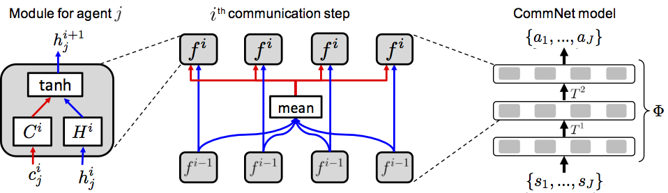

### Idea

在多agent的系统中，agent之间基于通信来协同完成某个任务，通信的内容作为控制器网络输入的一部分来辅助控制器输出动作。

### Content

整个群体的动作是通过对整个状态进行映射得到，这个映射实际上是由多个子映射部分构成的，“子映射”指的是对每个agent都有一个单独的controller，以agent自身的state作为输入，输出agent的动作；controller通常以网络表示。

考虑网络内K个时刻的连续通信（$i\in \{0,1,...,K\}$），对于第$j$个agent来说，$i+1$时刻的hidden state是跟$i$时刻的hidden state及获得的communication相关，即单个agent的controller输入为hidden state和communication；$i+1$时刻获得的communication是$i+1$时刻其他所有agent的hidden state，所以agent之间通信的内容是自己的hidden state。

$$h_{j}^{i+1} = f^{i}(h_{j}^{i}, c_{j}^{i})$$

$$c_{j}^{i+1} = \frac{1}{J-1} \sum_{j' \neq j }h_{j'}^{i+1}$$

考虑网络的输出$f$还会经过激活函数$σ$，且对hidden state和communication是分别经过全连接层处理并求和（i.e.， $ h_{j}^{i+1} = H^{i}h_{j}^{i}+C^{i}c_{j}^{i}$，$H^{i}$和$C^{i}$分别表示$i$时刻处理hidden state和communication的网络），所以下一时刻的hidden state可以表达成矩阵的形式：

$$\mathbf{h}^{i+1} = \sigma(T^{i}\mathbf{h}^{i})$$

其中，

$$T^{i} =   \left[ \begin{matrix}
   H^{i} & \bar{C}^{i} & ... & \bar{C}^{i}\\
   \bar{C}^{i} & H^{i} & ... & \bar{C}^{i}\\
   \bar{C}^{i} & \bar{C}^{i} & ... & H^{i}  
  \end{matrix} \right]$$

$$\mathbf{h}^{i} = [h_0^{i},h_1^{i},...,h_J^{i}]$$

$$\bar C^{i} = \frac{1}{J-1} C^{i}$$

在初始时刻， 对于所有的j设置$h_{j}^{0} = r(s_j)$，$c_{j}^{0} = 0$；对最后一层网络输出映射为一个分布（通常是一层全连接+softmax层），采样得到最终执行的动作（因为考虑的是离散动作，softmax得到的是每个动作的概率，根据这个概率采样；另外，如果动作的维度D，每个维度的取值有N个，那softmax输出的维度就是D*N）。下图所示，即为整个CommNet的框架，左边是对单个agent的controller（agent共享controller的参数），中间描述了agent之间（红色线表示广播）、相邻时刻之间（蓝色线）的信息流，右边是对多agent的CommNet从输入到输出的映射。

值得注意的一点是，agent的数量并不是一定的，所以communication信息中的归一化（求和项前面的系数$\frac{1}{J-1}$)是有必要的，$c$的大小不会受到agent数量的影响，那么在网络中作为输入的分布也不受影响。这样的思想还是比较直接的，主要是每个agent都有这样的一个独立controller，就避免了像完全集中式controller那样对于数量的敏感，并且每个controller内部还有一个“求和再归一化”的处理方式，所以使得单独的网络也能适用在不同数量agents的场景中。

### Highlight

（1）相比于直接学习通信内容的方法，通信内容作为RL中需要学习的策略，而真正执行的动作还需要另外的模块负责学习；CommNet将通信隐藏在网络前向计算过程中，RL直接学习的仍然是执行的动作，伴随着通信的隐式学习。

（2）相比于centralized controller的方法，存在对于共享所有state的高要求；CommNet对于个体来说只需要知道个体相应的state信息，广播的信息也只是hidden state，在可行性和通信内容大小方面应该更优。

##### Confusion

网络是怎么训练的，跟RL有什么关系？粗略看代码中的train相关段，好像controller的模型可以通过load不同的参数来输出不同的东西，如baseline（设置的输出维度是1，i.e.一个标量，而不是nactions，所以baseline应该就是state的评估函数值，网络的框架跟CommNet是一样的），在构造bp的loss的时候，将baseline和累积的reward作差（有点类似于TD error）。

##### Reference:

[Learning Multiagent Communication with Backpropagation (pdf and code)](https://cims.nyu.edu/~sainbar/commnet/)

