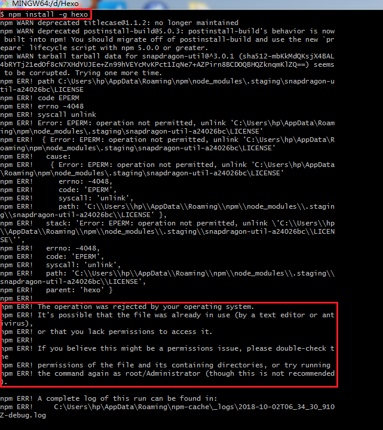
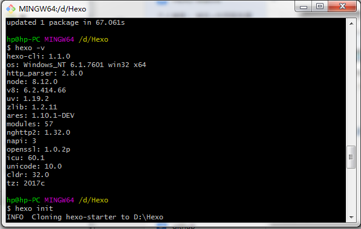
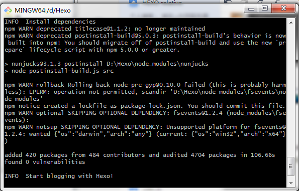
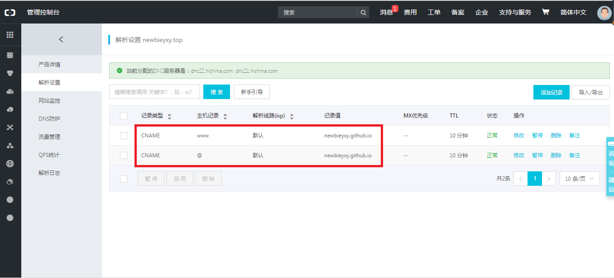
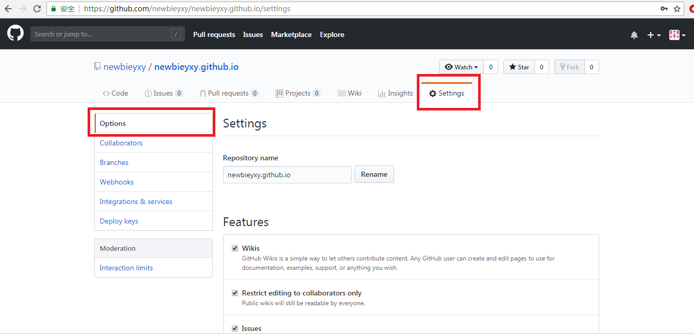

## 简介
这篇博客主要介绍基于hexo和github一步步搭建个人博客的过程，也是参考了网上很多的踩坑经验、各种骚操作后，最终成功地在网页上显示hello-world，因此整理总结一下。

## 下载Git和node.js
#### Git
(如果已经有git就可以忽略这一步)
官网下载： https://git-scm.com/download/win
安装过程比较顺畅，一般不需要特别的操作，选择默认的一直按界面的"Next"键即可，其中有一步关于其他配置选项如下图所示。


#### node.js
官网下载： http://nodejs.org/download/
安装过程同样地选择默认的即可（安装路径可以按照自己需要修改）

## 安装Hexo
首先在本地磁盘建立Hexo文件夹用于存储本地文件；然后打开Git Bash，并进入刚刚创建的Hexo文件夹。在Git命令行窗口中运行
```python
npm install -g hexo # -g 表示全局安装， 前面安装的node.js在此处就起到作用了
```

另外，这里可能需要以管理员身份运行Git，我在刚开始时直接运行Git并进入Hexo文件夹，在之后安装Hexo时会出现下图所示的错误。



前面一堆提示没怎么看懂，就只是看懂了后面几行关于权限的问题，然后退出原来的Git命令行窗口，重新以管理员身份运行，运行`hexo -v`没有报错则说明安装成功，问题就解决了！




初始化Hexo`hexo init`，在第一次初始化过程中竟然卡住了，一直停在Install dependencies之后，可能是网络原因，然后只能中断并重新开始初始化。




启动Hexo服务
```python
npm install
hexo server 
```
在本地打开链接 http://localhost:4000/ 就可以看到生成的网页hello-world，按Ctrl+C停止服务。重新部署更新时，可以使用以下命令，在本地打开网页即可查看到更新。
```python
hexo clean
hexo g # g for generate
hexo s # s for save
```

## GitHub及相关部署
#### Github注册账号
在 https://github.com 上注册账号，通过邮箱验证。

#### GitHub上创建项目(repository)
项目的命名是有要求的，为"<username\>.github.io"，<username\>替换为你的用户名。
#### 域名配置
+ 购买域名
可在阿里云官网 https://wanwang.aliyun.com/domain/ 购买
+ 域名解析
即相当于将你购买的域名映射到服务器（GitHub）的IP上，其中CNAME记录是指将域名解析为“目标域名的IP”，目标地址是一个域名，而解析目标是这个目标域名的IP。解析过程如下图所示。





+ Github项目绑定域名
打开GitHub上的项目<username>.github.io，点击在网页上方菜单栏中的Setting，选择左侧菜单来的Options，在各种设置中找到GitHub Pages，在Custon domain下方输入购买的域名并保存，这样就可以完成绑定了。
值得注意的是，创建项目只是建立了一个远程仓库，是没有具体内容的，因此在GitHub Pages下方会显示"GitHub Pages is currently disabled. You must first add content to your repository before you can publish a GitHub Pages site"，是没有Custom domain这一项的。可以通过点击菜单栏<code>，在下方选择主题，并commit changes，然后返回Setting界面，这时会看到GitHub Pages下方出现了Custom domain一项。




#### Hexo站点设置
+ 创建CNAME文件
在Hexo目录下的source文件夹中创建CNAME文件（**没有后缀名**），该文件中输入购买的域名。
+ 修改站点配置文件
在Hexo目录下有一个_config.yml文件，在文件最下方deploy处配置github项目连接
```python
deploy:
  type: git # 冒号后面有空格，后两行也是
  repository: https://github.com/<username>/<username>.github.io.git # <username>替换为自己的用户名
  branch: master
```

- 使用git部署
在之前的Git命令行窗口输入一下命令
```python
npm install hexo-deployer-git --save
```
	再执行如下命令，可在本地打开链接 http://localhost:4000 看到博客，
	```python
	hexo clean
	hexo g
	hexo s 
	```
	执行如下命令，
	```python
	hexo g
	hexo d # d for deployer
	```
	或者是直接执行`hexo d -g`，在浏览器输入购买的域名即可看到博客，就是激动人心的hello-world！


## References
- [hexo+github搭建个人博客(超详细教程)](https://blog.csdn.net/ainuser/article/details/77609180)
- [GitHub+Hexo 搭建个人网站详细教程](https://zhuanlan.zhihu.com/p/26625249)
