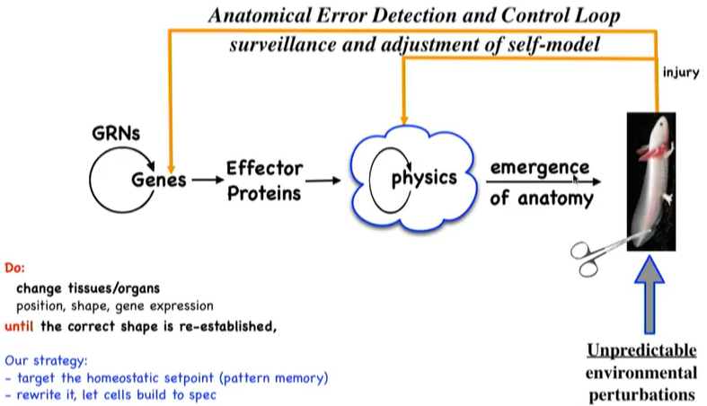
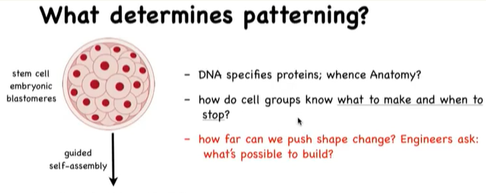
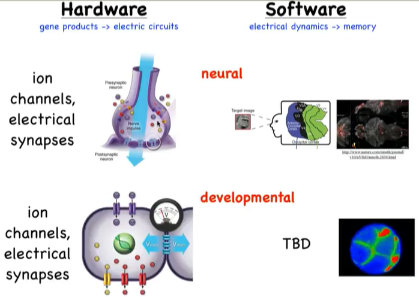

### 涡虫会有一前一后两个头吗？是有可能的！Michael Levin教授展示生物学中基于非神经框架的信息处理机制

生物体内的计算只发生在神经系统里吗？并不是！普通细胞也能够完成信息处理和计算。在NeurlPS2018会议上，塔夫茨大学（Tufts University）的Michael Levin教授发表了相关内容的演讲。Michael Levin教授通过展示他所在的研究中心的多项工作，介绍了生物电气系统的基础知识，并阐述了基于生物电气通信机制实现模式记忆重写，并对再生医学、合成生物工程在未来与机器学习的技术结合提出了展望。

Michael Levin在本次演讲中，主要展示了他的团队在生物细胞和组织的认知决策方面的相关研究工作，并提出基于非神经认知来开发强大AI技术的展望。演讲内容分为四部分展开：

- 第一部分介绍了生物界中的脑体可塑性；

- 第二部分阐述了生物体细胞和组织的认知能力，主要介绍它们在生物解剖学中，自我编辑的相关决策过程；

- 第三部分展示了一种基于非神经模式控制的生物电气机制，是细胞和组织能够进行大规模改造的重要基础；

- 最后一部分对于再生领域应用机器学习这种结合方式提出了兴趣和展望。

  

#### （一）脑体可塑性

Michael Levin举了个简单的例子：在毛毛虫蜕变为蝴蝶的过程中，它的大脑会液化和重建，但这个重建并不是完全的，因为前期的记忆仍然会被保留。这引发了我们的思考，记忆是怎样被保留在会经过激烈变化（液化和拆分）的媒介中的？Levin接着展示了团队在几年前在涡虫上进行的大脑重生（不仅是大脑，也可能是涡虫身体的某一节）和记忆留存的实验，想要进一步理解**生物记忆的编码和解码原理**是一个非常有挑战性的问题。

#### （二）再生和自我编辑中的决策

接下来，Levin大概介绍了解剖学中的再生和自我编辑现象。单细胞生物如虫胶（lac），没有大脑，但是能够很强地完成心理、模式和行为目标。当多个细胞组合一起构成多细胞生物时，细胞本身并没有丧失上述的功能。从一个单细胞生长为多细胞生物（胚胎发育过程），其中不仅仅涉及到干细胞生物学，因为干细胞能够生成各个组织或者是器官；更重要的是**更大规模的3D结构**。我们想要知道，这些大规模的结构是由什么确定的、搭建是怎么实现的（手是怎样长成某个样子的而不是另外的样子、细胞为什么生长到一定程度就不再生长了）。

在一般的认知中，生物发育机制是一个开环过程：基因控制了效应蛋白，这类蛋白组成生物体的各种组织，并最终构成整个生物体。 但在实际上，它是一个包含了**错误检测和控制功能**的闭环过程（如下图所示）。Levin教授列举了几个生物再生（regeneration）的例子，包括低等生物的完全再生（如被切分成多个片段的涡虫，每个片段都能生长为完整的涡虫）和高等生物的部分再生（如肝脏或者是骨头的再生），并指出再生的重要特性在于，**知道什么时候停止这些重建/重生**。可以认为，当在生物体上发生偏离目标形态的情况时，会影响基因转录（第一个过程）以及物理作用（第二个过程）；这个过程是一个**恒定的稳态过程**。

进一步地，Levin教授还提到一种**从乱序自动恢复正常**的实验结果。蝌蚪发育成青蛙的过程中，如果对脸部的一些器官做“打乱”操作（在没有定型之前），在完成形变之后进行形态分析和建模，发现脸部器官会自动恢复成正常的秩序。如果将蝾螈的尾巴剪掉，并放在被截肢的位置上，尾巴会逐渐重生为蝾螈的脚（即被截掉的肢体部位）。这种现象意味着，这不是一个单独的细胞决定它变成肌肉或者皮肤或者是其他任何东西，而是一个大规模的在整个系统上的决策过程，系统总会想方设法地去恢复全局的秩序。

从以上这些和生物再生相关的实验结果中可以看到，生物系统在面对激进的环境变化时，能够重新获得正常的结构以及功能，在根本上来说这是一种强大且复杂的计算能力，该能力解决的问题包含以下几项：

- 要生成的形状是什么（目标记忆）
- 现在是什么形状（状态获取）
- 如何形成目标形状（规划）
- 什么时候停止生长（决策）

这些可以概括为生物系统的模式稳态，这样的稳态具有一些认知特性：

 - 目标驱动行为，趋向构成特定的解剖学结果
 - 不同环境下的适应性和灵活性
 - 多细胞之间的相互协作、全局整个，构成整个复杂的大规模结构

这引发了我们的进一步思考，模式稳态是从哪里来的呢？DNA只是决定了蛋白质的结构和性质，但没有说明高级的组织形状和结构之类的。Levin教授提到，在当前生物领域的进展中存在knowledge gap的现象：生物工程师可以区分各种基因产物（即生物组织结构）的不同（即对应基因的区别，基因产物是怎样相互作用的）；但是**逆命题**是很难或者说无法完成的，即**没有办法通过读取基因、就知道某个器官的形状结果是怎样的**。生物工程师在分子或者是细胞这种很低级别的硬件上有很厉害的操作水平，然而在结构这样高层面上的了解是很少的，即大规模的模式编辑。于是，机器学习大显身手的机会：帮助生物学习理解这类信息是如何映射到解剖学，突破**再生药物**的进展。

#### （三）Levin教授分享团队关于生物电气通信机制的研究工作

Levin教授提到，就像大脑神经细胞一样，体细胞组织会形成**电气网络**来进行决策，这种决策并不是行为层面上的决策，而是关于**解剖学**的（**解剖学结构的形成**）。这种思想提出的根据有两点：

- 原始的单细胞生物具备的突触结构、离子通道和神经递质

- 神经细胞的计算是从体细胞的计算演化而来的，可以理解为大脑实际上并没有发明新的东西

Levin教授基于神经系统的“硬件部分”（细胞组成）和“软件部分”（信息处理），对提到的在普通体细胞之间存在的电气机制（electrical mechanism）展开进一步的介绍和描述。

通过操控内源性离子通道（这个通道能够让细胞产生电子状态；而不是通过电场或者是电极），来控制这个非神经细胞网络；通过改变这个生物电路，做了一些比较重要的实验。比如，在涡虫实验中，更改其中的电气状态，促使双头涡虫的产生。值得注意的是，当前所做的工作，**并没有改变基因组**，而只是一个实时的生理变化；（相当于通过控制细胞之间的交流，来实现**模块控制**）。另外，这不仅仅涉及到生物的再生，更是涉及到一种**长期**的现象，指的是记忆会保留（如果后续继续切割该涡虫，仍然会保留为two-head 的形态）：因为前面的操作，已经让这一区域的细胞/组织拥有一种记忆，就是当该组织发生损坏时，需要再生的是头部而不是尾部；相当于提供了一个electrical memory。基于上面的实验基础，Levin团队展开了进一步的再生实验：使用青蛙，通过给一些信号（使用了鸡尾酒来改变细胞的生物电状态），实现腿部的重生（青蛙和蝾螈不一样，不具备再生能力；这已经不仅仅是记忆重写了，而是相当于**构造记忆**）。这也是再生医学研究中的重要第一步：诱导细胞和组织重新生长各种复杂器官（**不需要引入干细胞，不需要基因组编辑**），而是通过某些方式改变细胞生物电模式、从而实现伤口处的细胞再生。

以上这些实验结果可以用于验证Levin教授团队工作的假设：模式记忆即是这些电路中的生理电气**状态**。另一方面，模式记忆具备一些特性：1）长期记忆稳定性；2）可重写（可覆盖）；3）潜藏性（可被召回）；4）独立的结果（discrete possible outcomes）。通过对模式记忆进行建模，来弄清楚这种生物电气网络（或者简称，电路）的**动力系统属性，怎样映射到特定的解剖学上**；从而可以基于建模工作，进行**模式记忆的重写工作**。在未来，希望能够开发出一种生物编译器（biological compiler），在解剖学层面上来设计生物；解决这种生物电信息编码问题，对于再生医学、通过形态工程计算来得到人工合成物都有很大的影响。

#### （四）未来展望

最后，Levin 教授提出了未来基于非神经结构的计算来搭建机器学习平台的展望。当前机器学习的局限性在于，人们通常关注如何模仿人类和大脑；但通过前面展示的工作可以看到，基于细胞和组织能够完成更多更重要的信息处理，我们可以尝试“后退”一下：基于细胞和组织的电气信息处理进行尝试。Levin教授列举的一些已有的对心脏、骨头和胰腺细胞等的研究例子，这些研究结果显示，这些体细胞和组织有很强的学习能力以及自我调整能力，即在新环境下的适应能力，这正是生物的强大之处。解决这个问题对于机器人技术、机器学习和人工智能的研究是有重要参考价值的。Levin认为，细胞间的电气信息处理，能够通过计算机编码来模拟这些过程；基于电气通信机制，利用机器学习的方法来研究再生医学。团队目前也开发数学和训练算法，可以用于non-neural networks；未来将使用机器学习的平台，帮助理解和发现生物系统中使用到的各种模型。